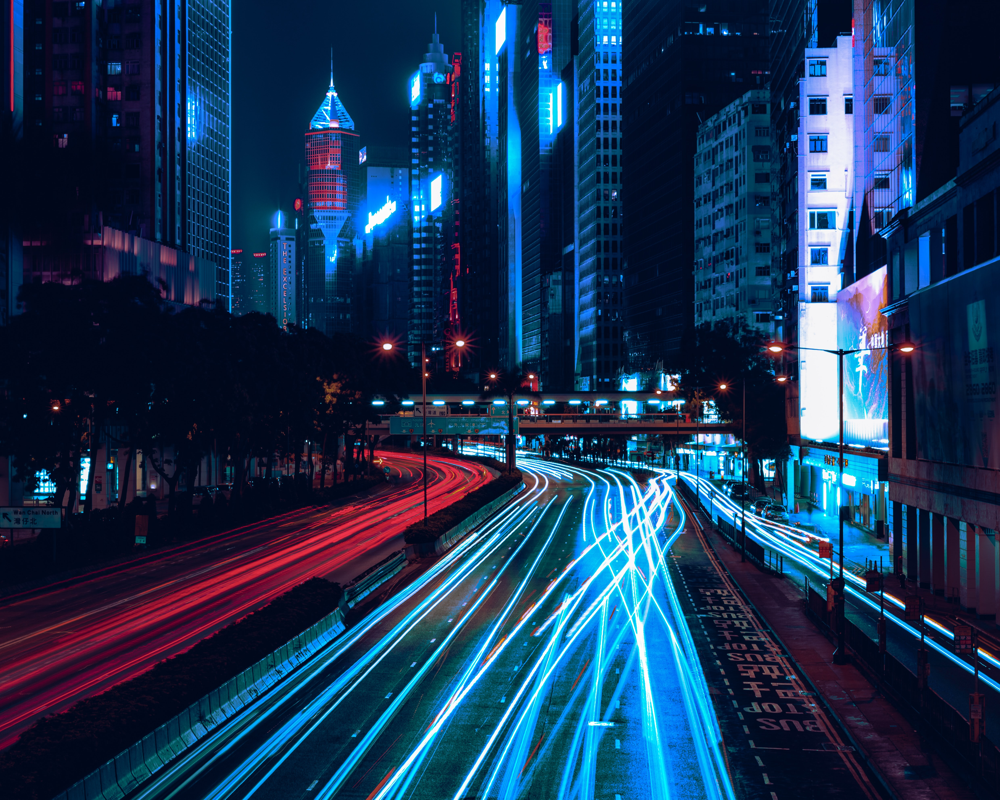
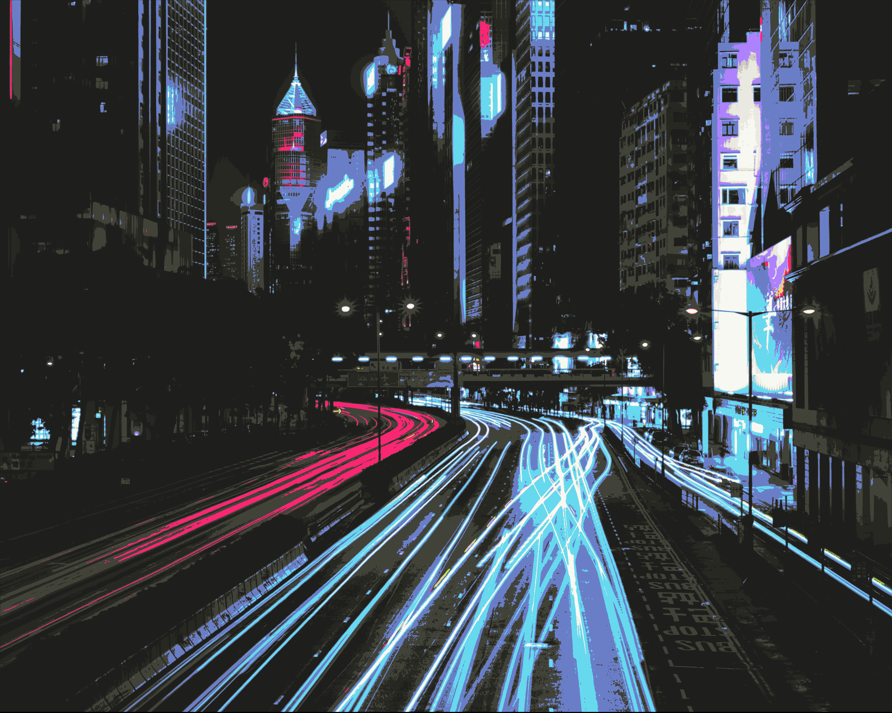

# Image Quantizer

[j'bang](https://www.jbang.dev/) script to quantize an image to a colour palette.

Heavily inspired by [ImageGoNord](https://github.com/Schrodinger-Hat/ImageGoNord).

By default it applies a (linear) pre blur to the image to reduce noise,
then quantizes each pixel to one of the colours in the Monokai colour scheme.

## Running

Requires [j'bang](https://www.jbang.dev/) to run

```bash
jbang ImageQuantizer.java input-image.png output-image.png
```

## Hacking

To use a different scheme, make a list of `java.awt.Color`,
and pass it to `ImageQuantize.quantizeImage` instead of `MONOKAI` in the `main` method.

## Demo

Run `make` in the root to replicate this demo

| Input | Output |
| ----- | ------ |
|  |  |

Photo by [Sean Foley](https://unsplash.com/photos/kMpbE_-jCeI) on [Unsplash](https://unsplash.com/)

## Limitations

 * The image is always output in `.png` format, no matter what extension you specify the output image to have.
